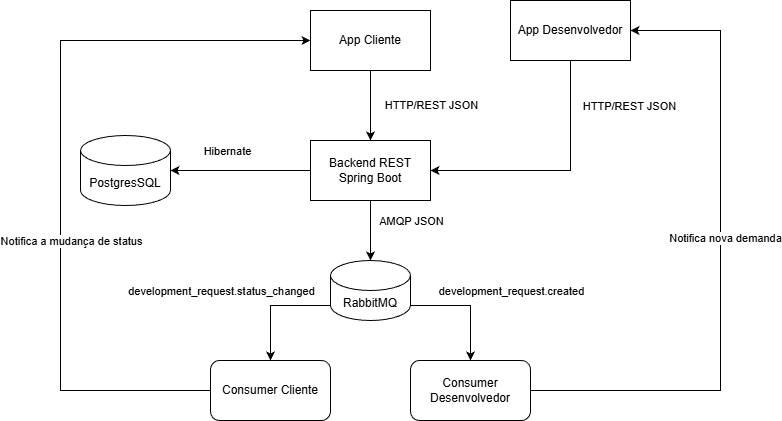

# Arquitetura - DevFacil

## Visao geral

## Componentes

| Componente | Tecnologia | Responsabilidade |
| --- | --- | --- |
| App Cliente | Flutter/Dart | Criar solicitacoes de desenvolvimento e acompanhar status. |
| App Desenvolvedor | Flutter/Dart | Receber demandas, aceitar/recusar e atualizar andamento. |
| Backend REST | Spring Boot/Java | Validar regras, expor endpoints, persistir dados e registrar eventos previstos. |
| Banco relacional | PostgreSQL | Armazenar clientes, desenvolvedores, solicitacoes e eventos pendentes. |
| MOM | RabbitMQ | Componente planejado para a Sprint 2, responsavel por distribuir eventos assincronos. |
| Consumer Desenvolvedor | Spring Boot/Java ou modulo consumidor | Receber eventos de novas solicitacoes e notificar o app do desenvolvedor. |
| Consumer Cliente | Spring Boot/Java ou modulo consumidor | Receber eventos de mudanca de status e notificar o app do cliente. |
| Podman | Containers | Executar API e banco de forma reproduzivel na Sprint 1; futuramente tambem RabbitMQ e consumers. |

## Protocolos

- Apps para backend: HTTP com JSON.
- Backend para banco: SQL via JPA/Hibernate.
- Backend para MOM: AMQP com mensagens JSON em filas/topicos.
- MOM para consumidores: consumo assincrono de eventos via AMQP.
- Consumers para apps: notificacao ou atualizacao assincrona do estado.

## Fluxo principal

1. Cliente cria uma solicitacao de desenvolvimento pelo App Cliente.
2. App Cliente envia a requisicao para o Backend REST usando HTTP/JSON.
3. Backend valida os dados e salva a solicitacao no PostgreSQL.
4. Backend registra o evento previsto `development_request.created` em `event_outbox`.
5. Na Sprint 2, esse evento sera publicado no RabbitMQ.
6. Consumer Desenvolvedor recebera a nova demanda e notificara o App Desenvolvedor.
7. Desenvolvedor aceita, recusa ou atualiza o andamento da solicitacao.
8. App Desenvolvedor envia a atualizacao para o Backend REST.
9. Backend atualiza o status no PostgreSQL.
10. Backend registra o evento previsto `development_request.status_changed`.
11. Na Sprint 2, o Consumer Cliente recebera a mudanca de status e notificara o App Cliente.

## Eventos previstos

O backend registra eventos previstos em `event_outbox` para facilitar a integracao futura com MOM:

| Evento | Quando ocorre | Consumidor previsto | Fila/topico previsto |
| --- | --- | --- | --- |
| `development_request.created` | Cliente cria uma solicitacao de desenvolvimento. | Consumer Desenvolvedor | `devfacil.development_requests` |
| `development_request.status_changed` | Desenvolvedor altera o status da solicitacao. | Consumer Cliente | `devfacil.status_updates` |
