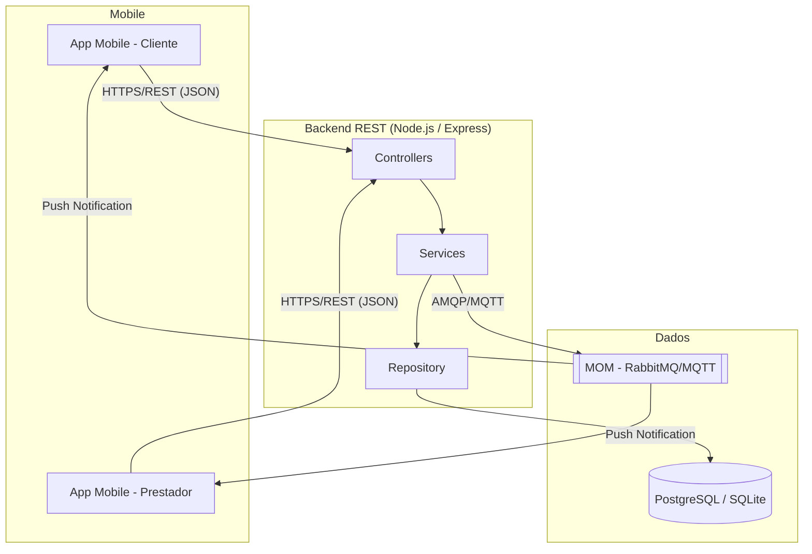

# Sprint 0 – Documento de Entrega Inicial

> **Projeto:** DevFácil  
> **Sprint:** 0  
> **Período:** ___/___/______ a ___/___/______  
> **Equipe:** _______________________________________________

---

## 1. Documento de Proposta

### 1.1 Descrição do Domínio

<!-- Descreva o domínio escolhido para o projeto. Exemplo:
O DevFácil atua no domínio de marketplace de serviços domésticos, conectando
clientes que necessitam de reparos/manutenções (encanamento, elétrica, pintura,
jardinagem etc.) a prestadores de serviços autônomos qualificados. -->

_(Preencher)_

### 1.2 Justificativa

<!-- Explique por que este domínio foi escolhido, qual problema ele resolve e
qual o valor entregue para os usuários. Dados de mercado e estatísticas são bem-vindos. -->

_(Preencher)_

### 1.3 Perfis de Usuário

#### 1.3.1 Cliente
- **Descrição:** _(Quem é o cliente? Faixa etária, necessidades, comportamento)_
- **Objetivos principais:**
  - [ ] _(ex.: contratar serviços domésticos de forma rápida e segura)_
  - [ ] _(ex.: acompanhar o andamento do serviço em tempo real)_
  - [ ] _(ex.: avaliar o prestador após a conclusão)_
- **Dores/Frustrações:**
  - [ ] _(ex.: dificuldade em encontrar prestadores confiáveis)_
  - [ ] _(ex.: falta de transparência no preço)_

#### 1.3.2 Prestador de Serviço
- **Descrição:** _(Quem é o prestador? Tipo de profissional, habilidades)_
- **Objetivos principais:**
  - [ ] _(ex.: ampliar sua carteira de clientes)_
  - [ ] _(ex.: gerenciar solicitações pelo celular)_
  - [ ] _(ex.: receber avaliações para construir reputação)_
- **Dores/Frustrações:**
  - [ ] _(ex.: falta de plataforma para divulgar serviços)_
  - [ ] _(ex.: dificuldade em organizar agenda de atendimentos)_

### 1.4 Principais Funcionalidades

| # | Funcionalidade                      | Perfil     | Prioridade |
|---|-------------------------------------|------------|------------|
| 1 | Cadastro e autenticação             | Ambos      | Alta       |
| 2 | Criar solicitação de serviço        | Cliente    | Alta       |
| 3 | Listar solicitações disponíveis     | Prestador  | Alta       |
| 4 | Aceitar / Recusar solicitação       | Prestador  | Alta       |
| 5 | Atualizar status do serviço         | Prestador  | Alta       |
| 6 | Consultar histórico de solicitações | Ambos      | Média      |
| 7 | Avaliar prestador                   | Cliente    | Média      |
| 8 | Notificações em tempo real          | Ambos      | Média      |
| 9 | _(Adicionar funcionalidade)_        | _(Perfil)_ | _(Prioridade)_ |

---

## 2. Diagrama de Arquitetura

### 2.1 Visão de Componentes

<!-- Insira aqui o diagrama de arquitetura. Pode ser uma imagem gerada no Draw.io,
     um diagrama Mermaid, C4 Model ou ferramenta equivalente. -->



### 2.2 Protocolo de Comunicação

| Camada                 | Protocolo    | Formato | Descrição                                   |
|------------------------|--------------|---------|---------------------------------------------|
| App ↔ Backend          | HTTPS        | JSON    | Requisições síncronas REST                  |
| Backend ↔ Banco        | TCP/IP (ORM) | SQL     | Consultas via Prisma/Sequelize               |
| Backend ↔ MOM          | AMQP ou MQTT | Binário | Eventos assíncronos e notificações           |
| MOM ↔ Apps             | WebSocket    | JSON    | Entrega de notificações push em tempo real   |

> **Ferramenta utilizada para o diagrama:** _(ex.: Draw.io / Mermaid / C4 Model)_  
> **Link / Arquivo:** _(inserir link ou nome do arquivo de diagrama)_

---

## 3. Backend REST Funcional

### 3.1 Configuração do Ambiente

- **Linguagem:** Node.js (TypeScript)
- **Framework:** Express.js
- **Versão Node:** _(ex.: 20.x)_
- **Porta padrão:** `3000`

### 3.2 Endpoints Implementados

#### 3.2.1 `POST /api/solicitacoes` – Criar Solicitação

**Descrição:** Cria uma nova solicitação de serviço vinculada ao cliente autenticado.

**Request Body:**
```json
{
  "descricao": "Consertar torneira vazando na cozinha",
  "categoria": "encanamento",
  "endereco": "Rua das Flores, 123 – São Paulo/SP",
  "cliente_id": "uuid-do-cliente"
}
```

**Response (201 Created):**
```json
{
  "id": "uuid-gerado",
  "descricao": "Consertar torneira vazando na cozinha",
  "categoria": "encanamento",
  "endereco": "Rua das Flores, 123 – São Paulo/SP",
  "status": "aguardando",
  "cliente_id": "uuid-do-cliente",
  "prestador_id": null,
  "criado_em": "2026-05-05T10:00:00.000Z"
}
```

**Response (400 Bad Request):**
```json
{
  "erro": "Campo obrigatório ausente: descricao"
}
```

---

#### 3.2.2 `GET /api/solicitacoes` – Listar Solicitações

**Descrição:** Retorna a lista de solicitações. Clientes veem apenas as suas; prestadores veem as disponíveis (status `aguardando`).

**Query Params (opcionais):**
| Parâmetro  | Tipo   | Descrição                             |
|------------|--------|---------------------------------------|
| `status`   | string | Filtrar por status                    |
| `categoria`| string | Filtrar por categoria de serviço      |
| `page`     | number | Paginação – número da página (padrão: 1) |
| `limit`    | number | Paginação – itens por página (padrão: 20) |

**Response (200 OK):**
```json
{
  "total": 2,
  "page": 1,
  "limit": 20,
  "dados": [
    {
      "id": "uuid-1",
      "descricao": "Consertar torneira",
      "status": "aguardando",
      "categoria": "encanamento",
      "criado_em": "2026-05-05T10:00:00.000Z"
    },
    {
      "id": "uuid-2",
      "descricao": "Pintar quarto",
      "status": "aguardando",
      "categoria": "pintura",
      "criado_em": "2026-05-05T11:00:00.000Z"
    }
  ]
}
```

---

#### 3.2.3 `GET /api/solicitacoes/:id` – Consultar Solicitação por ID

**Descrição:** Retorna os detalhes de uma solicitação específica.

**Path Params:**
| Parâmetro | Tipo   | Descrição             |
|-----------|--------|-----------------------|
| `id`      | UUID   | ID da solicitação     |

**Response (200 OK):**
```json
{
  "id": "uuid-1",
  "descricao": "Consertar torneira vazando na cozinha",
  "categoria": "encanamento",
  "endereco": "Rua das Flores, 123 – São Paulo/SP",
  "status": "em_andamento",
  "cliente_id": "uuid-do-cliente",
  "prestador_id": "uuid-do-prestador",
  "criado_em": "2026-05-05T10:00:00.000Z",
  "atualizado_em": "2026-05-05T12:00:00.000Z"
}
```

**Response (404 Not Found):**
```json
{
  "erro": "Solicitação não encontrada"
}
```

---

#### 3.2.4 `PATCH /api/solicitacoes/:id/status` – Atualizar Status

**Descrição:** Atualiza o status de uma solicitação (usado pelo prestador).

**Path Params:**
| Parâmetro | Tipo   | Descrição             |
|-----------|--------|-----------------------|
| `id`      | UUID   | ID da solicitação     |

**Request Body:**
```json
{
  "status": "em_andamento",
  "prestador_id": "uuid-do-prestador"
}
```

**Valores válidos para `status`:**
- `aguardando` – aguardando aceite de prestador
- `aceito` – prestador aceitou, serviço agendado
- `em_andamento` – serviço em execução
- `concluido` – serviço finalizado
- `cancelado` – solicitação cancelada

**Response (200 OK):**
```json
{
  "id": "uuid-1",
  "status": "em_andamento",
  "atualizado_em": "2026-05-05T12:30:00.000Z"
}
```

**Response (400 Bad Request):**
```json
{
  "erro": "Status inválido. Valores permitidos: aguardando, aceito, em_andamento, concluido, cancelado"
}
```

---

### 3.3 Evidência de Execução

<!-- Adicione aqui prints ou logs demonstrando que os endpoints foram testados e estão funcionando. -->

_(Adicionar capturas de tela / logs de execução)_

---

## 4. Banco de Dados

### 4.1 Tecnologia Utilizada

- **Banco de dados:** _(ex.: SQLite / PostgreSQL / MongoDB)_
- **Versão:** _(ex.: PostgreSQL 16 / SQLite 3.x)_
- **ORM / Driver:** _(ex.: Prisma / Sequelize / sqlite3)_

### 4.2 Schema Completo

#### Tabela `usuarios`

| Coluna       | Tipo         | Restrições                              | Descrição                     |
|--------------|--------------|-----------------------------------------|-------------------------------|
| `id`         | UUID / TEXT  | PRIMARY KEY, DEFAULT gen_random_uuid()  | Identificador único           |
| `nome`       | VARCHAR(100) | NOT NULL                                | Nome completo                 |
| `email`      | VARCHAR(150) | UNIQUE, NOT NULL                        | E-mail (usado no login)       |
| `senha_hash` | TEXT         | NOT NULL                                | Hash bcrypt da senha          |
| `perfil`     | VARCHAR(20)  | NOT NULL, CHECK IN ('cliente','prestador') | Tipo de usuário            |
| `criado_em`  | TIMESTAMP    | DEFAULT NOW()                           | Data de criação do cadastro   |

#### Tabela `solicitacoes`

| Coluna          | Tipo         | Restrições                              | Descrição                         |
|-----------------|--------------|-----------------------------------------|-----------------------------------|
| `id`            | UUID / TEXT  | PRIMARY KEY, DEFAULT gen_random_uuid()  | Identificador único               |
| `cliente_id`    | UUID / TEXT  | FK → usuarios(id), NOT NULL             | Cliente que criou a solicitação   |
| `prestador_id`  | UUID / TEXT  | FK → usuarios(id), NULLABLE             | Prestador que aceitou             |
| `descricao`     | TEXT         | NOT NULL                                | Descrição do serviço necessário   |
| `categoria`     | VARCHAR(50)  | NOT NULL                                | Categoria (encanamento, elétrica…)|
| `endereco`      | TEXT         | NOT NULL                                | Endereço de execução do serviço   |
| `status`        | VARCHAR(30)  | NOT NULL, DEFAULT 'aguardando'          | Status atual da solicitação       |
| `criado_em`     | TIMESTAMP    | DEFAULT NOW()                           | Data de criação                   |
| `atualizado_em` | TIMESTAMP    | DEFAULT NOW()                           | Data da última atualização        |

#### Tabela `avaliacoes` _(opcional nesta sprint)_

| Coluna           | Tipo        | Restrições                             | Descrição                      |
|------------------|-------------|----------------------------------------|--------------------------------|
| `id`             | UUID / TEXT | PRIMARY KEY                            | Identificador único            |
| `solicitacao_id` | UUID / TEXT | FK → solicitacoes(id), UNIQUE          | Solicitação avaliada           |
| `nota`           | INTEGER     | NOT NULL, CHECK (nota BETWEEN 1 AND 5) | Nota de 1 a 5 estrelas         |
| `comentario`     | TEXT        | NULLABLE                               | Comentário opcional            |
| `criado_em`      | TIMESTAMP   | DEFAULT NOW()                          | Data da avaliação              |

### 4.3 Script SQL (DDL)

```sql
-- Habilitar extensão UUID (PostgreSQL)
-- CREATE EXTENSION IF NOT EXISTS "pgcrypto";

CREATE TABLE IF NOT EXISTS usuarios (
  id         TEXT PRIMARY KEY DEFAULT (lower(hex(randomblob(4))) || '-' ||
                                        lower(hex(randomblob(2))) || '-4' ||
                                        substr(lower(hex(randomblob(2))),2) || '-' ||
                                        substr('89ab',abs(random()) % 4 + 1, 1) ||
                                        substr(lower(hex(randomblob(2))),2) || '-' ||
                                        lower(hex(randomblob(6)))),
  nome       VARCHAR(100) NOT NULL,
  email      VARCHAR(150) UNIQUE NOT NULL,
  senha_hash TEXT         NOT NULL,
  perfil     VARCHAR(20)  NOT NULL CHECK (perfil IN ('cliente', 'prestador')),
  criado_em  DATETIME     DEFAULT CURRENT_TIMESTAMP
);

CREATE TABLE IF NOT EXISTS solicitacoes (
  id            TEXT PRIMARY KEY,
  cliente_id    TEXT NOT NULL REFERENCES usuarios(id),
  prestador_id  TEXT REFERENCES usuarios(id),
  descricao     TEXT NOT NULL,
  categoria     VARCHAR(50) NOT NULL,
  endereco      TEXT NOT NULL,
  status        VARCHAR(30) NOT NULL DEFAULT 'aguardando'
                  CHECK (status IN ('aguardando','aceito','em_andamento','concluido','cancelado')),
  criado_em     DATETIME DEFAULT CURRENT_TIMESTAMP,
  atualizado_em DATETIME DEFAULT CURRENT_TIMESTAMP
);

CREATE TABLE IF NOT EXISTS avaliacoes (
  id              TEXT PRIMARY KEY,
  solicitacao_id  TEXT UNIQUE NOT NULL REFERENCES solicitacoes(id),
  nota            INTEGER NOT NULL CHECK (nota BETWEEN 1 AND 5),
  comentario      TEXT,
  criado_em       DATETIME DEFAULT CURRENT_TIMESTAMP
);
```

### 4.4 Diagrama ER (Entidade-Relacionamento)

```
┌──────────────┐        ┌──────────────────┐        ┌──────────────┐
│   usuarios   │        │   solicitacoes   │        │  avaliacoes  │
│──────────────│        │──────────────────│        │──────────────│
│ id (PK)      │◄──┐    │ id (PK)          │◄───────│ id (PK)      │
│ nome         │   └────│ cliente_id (FK)  │        │solicitacao_id│
│ email        │        │ prestador_id (FK)│        │ nota         │
│ senha_hash   │◄───────│ descricao        │        │ comentario   │
│ perfil       │        │ categoria        │        │ criado_em    │
│ criado_em    │        │ endereco         │        └──────────────┘
└──────────────┘        │ status           │
                        │ criado_em        │
                        │ atualizado_em    │
                        └──────────────────┘
```

---

## 5. Coleção de Testes (Postman / Insomnia)

### 5.1 Arquivo Exportado

<!-- Anexe o arquivo .json exportado do Postman ou Insomnia com todos os endpoints. -->

- **Ferramenta:** _(ex.: Postman / Insomnia)_
- **Arquivo:** _(ex.: `DevFacil_Sprint0.postman_collection.json`)_
- **Localização no repositório:** `code/backend/tests/`

### 5.2 Resumo dos Testes Documentados

| # | Endpoint                          | Método | Cenário Testado              | Status Esperado |
|---|-----------------------------------|--------|------------------------------|-----------------|
| 1 | `/api/solicitacoes`               | POST   | Criar solicitação válida     | 201 Created     |
| 2 | `/api/solicitacoes`               | POST   | Body inválido (campo faltando)| 400 Bad Request |
| 3 | `/api/solicitacoes`               | GET    | Listar todas as solicitações | 200 OK          |
| 4 | `/api/solicitacoes?status=aguardando` | GET | Listar filtrando por status  | 200 OK          |
| 5 | `/api/solicitacoes/:id`           | GET    | Consultar por ID existente   | 200 OK          |
| 6 | `/api/solicitacoes/:id`           | GET    | Consultar por ID inexistente | 404 Not Found   |
| 7 | `/api/solicitacoes/:id/status`    | PATCH  | Atualizar para status válido | 200 OK          |
| 8 | `/api/solicitacoes/:id/status`    | PATCH  | Status inválido              | 400 Bad Request |
| 9 | _(Adicionar caso de teste)_       | _(_)_  | _(Cenário)_                  | _(_)_           |

### 5.3 Variáveis de Ambiente (Postman/Insomnia)

| Variável      | Valor de Exemplo              | Descrição                     |
|---------------|-------------------------------|-------------------------------|
| `base_url`    | `http://localhost:3000`       | URL base da API               |
| `cliente_id`  | `uuid-do-cliente-de-teste`    | ID do cliente para testes     |
| `prestador_id`| `uuid-do-prestador-de-teste`  | ID do prestador para testes   |
| `solicitacao_id` | `uuid-da-solicitacao`      | ID de solicitação para testes |

> **Instruções para importar:**
> 1. Abra o Postman ou Insomnia.
> 2. Clique em **Import** e selecione o arquivo exportado.
> 3. Configure as variáveis de ambiente com os valores correspondentes ao seu ambiente local.
> 4. Execute a coleção completa para validar todos os endpoints.

---

## 6. Considerações Finais e Próximos Passos

<!-- Registre observações, impedimentos encontrados durante a Sprint 0 e o que será priorizado na Sprint 1. -->

### 6.1 Impedimentos / Observações

_(Preencher – ex.: dificuldades técnicas, decisões de arquitetura que precisam ser revisadas)_

### 6.2 Próximos Passos (Sprint 1)

- [ ] _(ex.: Implementar autenticação JWT)_
- [ ] _(ex.: Criar telas de cadastro e login no app mobile)_
- [ ] _(ex.: Integrar app com endpoints do backend)_
- [ ] _(ex.: Configurar MOM para notificações em tempo real)_
- [ ] _(ex.: Deploy da API em ambiente de staging)_
